# MVP ERD v2.0

D.COM 인트라넷 개편 프로젝트의 MVP 기준 ERD이다.

## 설계 기준

- 백엔드 기준 브랜치: `develop`
- DB 작업 브랜치: `feature/database` 또는 `database`
- 최종 PR 대상 브랜치: `develop`
- 최종 DB: MariaDB
- 현재 백엔드 개발 DB: H2 인메모리 DB 가능
- ERD 기준: Notion MVP ver 2.0 + 백엔드 `develop` 브랜치 Entity 구조

## 주요 설계 원칙

### Enum 관리 기준

서비스 정책상 값의 집합을 우리가 통제할 수 있는 컬럼은 enum으로 관리한다.

Enum 대상:

- `users.role`
- `users.status`
- `archive_records.semester`
- `archive_records.exam_type`

단, DB에서는 MariaDB `ENUM` 타입을 직접 사용하기보다 `VARCHAR` 컬럼에 저장하고, JPA에서 `EnumType.STRING`을 사용하는 방식을 우선 고려한다.

### MIME 타입 처리

파일의 `content_type`은 MIME 타입이다.

예시:

- `application/pdf`
- `image/png`
- `image/jpeg`
- `application/zip`
- `application/x-zip-compressed`

MIME 타입은 파일 형식과 클라이언트 환경에 따라 다양한 값이 들어올 수 있으므로 enum으로 제한하지 않고 `VARCHAR`로 저장한다.

### 족보 아카이브 중복 방지

`archives` 테이블에서 `subject_name`과 `professor_name`은 각각 unique가 아니다.

다음 복합 unique 제약조건을 사용한다.

```sql
UNIQUE (subject_name, professor_name)
```

의미:

- 같은 과목명 + 같은 교수명 조합의 아카이브 중복 생성을 방지한다.
- 같은 과목명에 다른 교수명은 허용한다.
- 같은 교수명이 다른 과목을 담당하는 것도 허용한다.

### 레거시 마이그레이션 범위

레거시 DB 전체를 이전하지 않는다.

마이그레이션 대상:

- 기존 게시판 중 족보 게시판
- `boards.boardid = 'jokbo'`인 게시글
- 족보 게시글에 연결된 댓글 중 의미 있는 본문 또는 파일 링크가 있는 댓글
- 족보 게시글/댓글 본문에서 참조된 파일
- 실제 파일 바이너리

마이그레이션 제외 대상:

- 기존 `users`
- `viewers`
- `groups`
- `groups_users`
- `loggers`
- `password_resets`
- `migrations`
- `dcomfiles`
- 족보에서 참조되지 않은 파일

기존 유저 데이터는 이전하지 않으므로, 마이그레이션된 족보의 작성자는 `migration admin` 계정으로 연결하는 방식을 우선 검토한다.

---

## Mermaid ERD

```mermaid
erDiagram

    USERS {
        BIGINT id PK "AUTO_INCREMENT"
        VARCHAR login_id UK "로그인 ID"
        VARCHAR password "암호화 비밀번호"
        VARCHAR name "이름"
        VARCHAR student_id UK "학번"
        VARCHAR email UK "이메일"
        VARCHAR phone_number "전화번호"
        ENUM role "USER / ADMIN"
        ENUM status "PENDING / APPROVED / WITHDRAWN"
        DATETIME created_at "가입 신청 일시"
        DATETIME last_login_at "최근 로그인 일시"
        VARCHAR temp_password "임시 비밀번호 해시"
        DATETIME temp_password_expires_at "임시 비밀번호 만료 일시"
    }

    EMAIL_VERIFICATIONS {
        BIGINT id PK "AUTO_INCREMENT"
        VARCHAR email "인증 대상 이메일"
        VARCHAR code "인증 코드"
        DATETIME expires_at "만료 일시"
        BOOLEAN verified "인증 완료 여부"
        DATETIME created_at "생성 일시"
    }

    REFRESH_TOKENS {
        BIGINT id PK "AUTO_INCREMENT"
        VARCHAR token UK "Refresh Token"
        VARCHAR login_id "사용자 로그인 ID"
        DATETIME expires_at "만료 일시"
        DATETIME created_at "생성 일시"
    }

    ARCHIVES {
        BIGINT archive_id PK "AUTO_INCREMENT"
        VARCHAR subject_name "과목명"
        VARCHAR professor_name "교수명"
        DATETIME created_at "생성 일시"
        DATETIME last_modified_at "최근 수정 일시"
    }

    ARCHIVE_RECORDS {
        BIGINT record_id PK "AUTO_INCREMENT"
        BIGINT archive_id FK "소속 아카이브 ID"
        BIGINT author_id FK "작성자 ID"
        INT exam_year "시험 연도"
        ENUM semester "FIRST / SECOND / SUMMER / WINTER, 선택값"
        ENUM exam_type "MIDTERM / FINAL / QUIZ / ASSIGNMENT / ETC, 선택값"
        TEXT content "족보 설명 또는 텍스트형 족보"
        DATETIME created_at "등록 일시"
        DATETIME updated_at "수정 일시"
    }

    ARCHIVE_FILES {
        BIGINT archive_file_id PK "AUTO_INCREMENT"
        BIGINT record_id FK "소속 족보 기록 ID"
        VARCHAR original_file_name "원본 파일명"
        VARCHAR stored_file_name "서버 저장 파일명"
        VARCHAR object_key "로컬 저장소 내부 key/path"
        VARCHAR file_url "API 응답용 URL 또는 접근 경로"
        BIGINT file_size "파일 크기"
        VARCHAR content_type "MIME 타입, 예: application/pdf"
        INT download_count "다운로드 수"
        DATETIME created_at "생성 일시"
    }

    INFO_POSTS {
        BIGINT post_id PK "AUTO_INCREMENT"
        BIGINT author_id FK "작성자 ID"
        VARCHAR title "게시글 제목"
        LONGTEXT content "게시글 본문"
        INT views "조회수"
        DATETIME created_at "작성 일시"
        DATETIME updated_at "수정 일시"
    }

    INFO_POST_FILES {
        BIGINT file_id PK "AUTO_INCREMENT"
        BIGINT post_id FK "소속 정보 공유 게시글 ID"
        VARCHAR original_file_name "원본 파일명"
        VARCHAR stored_file_name "서버 저장 파일명"
        VARCHAR object_key "로컬 저장소 내부 key/path"
        VARCHAR file_url "API 응답용 URL 또는 접근 경로"
        BIGINT file_size "파일 크기"
        VARCHAR content_type "MIME 타입"
    }

    INFO_COMMENTS {
        BIGINT comment_id PK "AUTO_INCREMENT"
        BIGINT post_id FK "소속 정보 공유 게시글 ID"
        BIGINT author_id FK "작성자 ID"
        LONGTEXT content "댓글 내용"
        DATETIME created_at "작성 일시"
        DATETIME updated_at "수정 일시"
    }

    NOTICES {
        BIGINT notice_id PK "AUTO_INCREMENT"
        VARCHAR title "공지 제목"
        LONGTEXT content "공지 본문"
        BIGINT author_id "작성자 ID, 현재 코드상 FK 아님"
        DATETIME created_at "작성 일시"
        DATETIME updated_at "수정 일시"
    }

    NOTICE_FILES {
        BIGINT notice_file_id PK "AUTO_INCREMENT"
        BIGINT notice_id FK "공지사항 ID"
        VARCHAR original_file_name "원본 파일명"
        VARCHAR file_url "파일 URL"
    }

    PHOTO_POSTS {
        BIGINT album_id PK "AUTO_INCREMENT"
        VARCHAR event_name "행사명"
        DATE activity_date "활동 일자"
        LONGTEXT description "앨범 설명"
    }

    PHOTO_POST_IMAGES {
        BIGINT album_id FK "소속 사진첩 ID"
        INT upload_order "업로드 순서"
        VARCHAR image_url "이미지 URL"
    }

    PHOTO_COMMENTS {
        BIGINT comment_id PK "AUTO_INCREMENT"
        BIGINT album_id FK "소속 사진첩 ID"
        BIGINT author_id FK "작성자 ID"
        LONGTEXT content "댓글 내용"
        DATETIME created_at "작성 일시"
        DATETIME updated_at "수정 일시"
    }

    LEGACY_MIGRATION_MAPS {
        BIGINT id PK "AUTO_INCREMENT"
        BIGINT archive_record_id FK "신규 archive_records.record_id"
        BIGINT archive_file_id FK "신규 archive_files.archive_file_id"
        BIGINT legacy_board_id "기존 boards.id"
        BIGINT legacy_comment_id "기존 comments.id"
        BIGINT legacy_file_id "기존 files.id"
        VARCHAR legacy_filename "기존 files.filename"
        VARCHAR legacy_original_filename "기존 files.original_filename"
        DATETIME created_at "매핑 생성 일시"
    }

    USERS ||--o{ ARCHIVE_RECORDS : "writes"
    ARCHIVES ||--o{ ARCHIVE_RECORDS : "contains"
    ARCHIVE_RECORDS ||--o{ ARCHIVE_FILES : "has"

    USERS ||--o{ INFO_POSTS : "writes"
    INFO_POSTS ||--o{ INFO_POST_FILES : "has"
    INFO_POSTS ||--o{ INFO_COMMENTS : "has"
    USERS ||--o{ INFO_COMMENTS : "writes"

    USERS ||--o{ NOTICES : "writes"
    NOTICES ||--o{ NOTICE_FILES : "embeds"

    PHOTO_POSTS ||--o{ PHOTO_POST_IMAGES : "has"
    PHOTO_POSTS ||--o{ PHOTO_COMMENTS : "has"
    USERS ||--o{ PHOTO_COMMENTS : "writes"
```



---

## 테이블별 메모

### USERS

회원 정보를 저장한다.

주의 사항:

- `role`은 `USER`, `ADMIN`으로 관리한다.
- `status`는 `PENDING`, `APPROVED`, `WITHDRAWN`으로 관리한다.
- 회원 탈퇴 시 물리 삭제보다 `WITHDRAWN` 상태 변경을 우선 고려한다.
- 탈퇴 후 일정 기간이 지나면 삭제하는 정책은 별도 배치 작업으로 검토한다.

### EMAIL_VERIFICATIONS

이메일 인증 코드를 저장한다.

주의 사항:

- `verified`는 인증 완료 여부이다.
- 코드상 오타인 `vertified`가 있다면 `verified`로 수정한다.

### REFRESH_TOKENS

Refresh Token 정보를 저장한다.

주의 사항:

- 현재 백엔드 구현 기준으로 `user_id` FK가 아니라 `login_id`를 저장할 수 있다.
- 장기적으로는 `user_id` FK 구조를 검토할 수 있다.

### ARCHIVES

과목명과 교수명 조합 단위의 족보 아카이브이다.

제약조건:

```sql
UNIQUE (subject_name, professor_name)
```

### ARCHIVE_RECORDS

개별 족보 기록이다.

주의 사항:

- `exam_year`, `semester`, `exam_type`은 선택값으로 검토한다.
- `semester`, `exam_type`은 enum이지만 nullable 허용이 필요하다.
- 마이그레이션 데이터의 작성자는 기존 유저를 이전하지 않으므로 `migration admin` 계정으로 연결하는 방식을 우선 검토한다.

### ARCHIVE_FILES

족보 첨부파일 메타데이터를 저장한다.

주의 사항:

- 실제 파일 바이너리는 DB에 저장하지 않는다.
- DB에는 파일 메타데이터와 내부 저장 key/path를 저장한다.
- `content_type`은 MIME 타입이므로 enum으로 제한하지 않는다.
- `download_count`는 족보 다운로드 수 관리를 위해 사용한다.

### INFO_POSTS

정보 공유 게시글이다.

주의 사항:

- `views`는 조회수이다.
- 좋아요 기능은 MVP ERD에서는 제외한다.

### INFO_POST_FILES

정보 공유 게시글 첨부파일 메타데이터이다.

주의 사항:

- `content_type`은 MIME 타입이므로 `VARCHAR`로 저장한다.

### INFO_COMMENTS

정보 공유 게시글 댓글이다.

### NOTICES

공지사항이다.

주의 사항:

- 현재 코드상 `author_id`가 `User` FK가 아니라 단순 `Long authorId`일 수 있다.
- FK로 바꿀지 현재 구조를 유지할지는 회의에서 결정한다.

### NOTICE_FILES

공지사항 첨부파일이다.

주의 사항:

- 최신 develop 기준 백엔드 코드는 별도 `NoticeFile` Entity 구조이다.
- 현재 구현 컬럼은 `original_file_name`, `file_url` 중심이다.
- `object_key`, `file_size`, `content_type` 같은 추가 파일 메타데이터가 필요한지는 추후 검토한다.

### PHOTO_POSTS / PHOTO_POST_IMAGES / PHOTO_COMMENTS

활동 사진 앨범 관련 테이블이다.

주의 사항:

- 최신 develop 코드 기준 테이블명은 `photo_posts`, `photo_post_images`, `photo_comments`이다.
- `photo_post_images`는 별도 이미지 Entity가 아니라 `PhotoPost.imageUrls`의 `@ElementCollection` 구조이다.
- 현재 구현은 이미지 메타데이터 없이 `image_url`만 저장한다.

### LEGACY_MIGRATION_MAPS

레거시 족보 데이터와 신규 아카이브 데이터의 매핑 추적용 테이블이다.

주의 사항:

- 운영 테이블에 레거시 컬럼을 직접 넣지 않기 위해 별도 매핑 테이블을 둔다.
- 기존 유저 데이터는 이전하지 않으므로 `legacy_uploader_id`는 저장하지 않는다.
- 단일 레거시 DB 출처이므로 `migration_source`는 저장하지 않는다.
- 범용 `target_table`, `target_id`, `legacy_table` 구조 대신 족보 전용 컬럼을 사용한다.

---

## 회의에서 결정해야 할 항목

1. `archive_records.exam_year` nullable 허용 여부
2. `archive_records.semester` nullable 허용 여부
3. `archive_records.exam_type` nullable 허용 여부
4. `archive_files.file_url`을 DB에 저장할지, `object_key` 기반으로 API에서 생성할지
5. `notice_files`에 추가 파일 메타데이터를 둘지
6. `legacy_migration_maps`를 실제 DB 테이블로 둘지 CSV로만 관리할지
7. 마이그레이션된 족보의 `author_id`에 사용할 `migration admin` 계정 생성 방식
8. 유저 탈퇴 시 작성 콘텐츠 유지 정책
9. 게시글 삭제 시 댓글/파일 cascade 삭제 정책
10. MariaDB 전환 시점과 `ddl-auto` 설정 변경 방식

---

## 향후 작업 순서

1. 백엔드 `develop` 브랜치 Entity와 ERD 비교
2. 불일치 항목 정리
3. 회의에서 DB 정책 확정
4. MariaDB DDL 초안 작성
5. 로컬 MariaDB 연결 테스트
6. 샘플 데이터 삽입 테스트
7. 족보 마이그레이션 스크립트 설계
8. `database` 또는 `feature/database` 브랜치에서 `develop`으로 PR 생성
